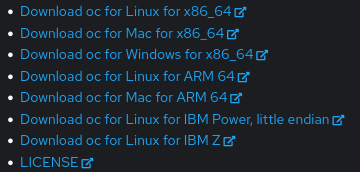
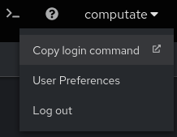
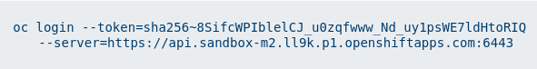
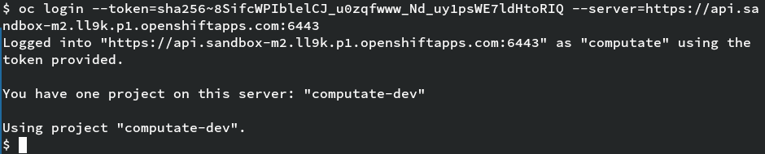
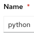
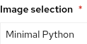

# Visualizing open source Smart Village data in the New England Research Cloud
## Brought to you by the Smarta Byar Smart Village Community FIWARE iHub
## Written by Christopher Tate

- Red Hat Principal Software Engineer in Red Hat Research
- Creator of the Smart Village Operator and Smart Village Platform
- Architect of the Red Hat Social Innovation Program
- Founder of the Smarta Byar Smart Village Community FIWARE Innovation Hub
- Principal Software Engineer for the New England Research Cloud

## Using the New England Research Cloud OpenShift Environment

Log into the New England Research Cloud OpenShift Environment here [https://console.apps.shift.nerc.mghpcc.org](https://console.apps.shift.nerc.mghpcc.org). 

### Download the oc command
- Click the

button in the top right of OpenShift container.

- Click
.
- Click the download link for your operating system.


- You'll need to extract the `oc` command and place it in your path,
for example in a `bin` directory in your `$HOME` directory.

```bash
mkdir -p ~/bin
tar xvf ~/Downloads/oc.tar -C ~/bin/
```

### Log into the OpenShift CLI in your terminal


- Click your username in the top right corner of OpenShift.
- Click
.
- Click
.
- Click
.
- Copy the line to the clipboard that looks like this:


- Paste the command into your terminal to log in to OpenShift in the terminal.



### Grant default service account edit role in namespace

To grant the default service account edit role privileges, you will use
either your own terminal where you have logged in to OpenShift, or use
the built-in OpenShift Terminal. We will grant edit privileges on the
default service account, as well as edit privileges on roles and
rolebindings in the namespace so that the default service account can
deploy resources in your namespace.

```
oc create rolebinding sumo-edit --clusterrole=edit \
  --serviceaccount=smart-village-faeeb6c:sumo

oc create role sumo-edit-rolebindings \
  --verb=get,list,watch,create,update,patch,delete \
  --resource=roles,rolebindings

oc create rolebinding sumo-edit-rolebindings --role=sumo-edit-rolebindings \
  --serviceaccount=smart-village-faeeb6c:sumo
```

# OpenShift AI

## Set up an OpenShift AI Workbench

### Accessing OpenShift AI

In the OpenShift Console, click on the apps button

at the top,

then click

to log into OpenShift AI.

Click the button to
.

Log into OpenShift AI by clicking on the

button.

Once you are in OpenShift AI, click on the menu button
,
then click
.

Then click on the name of your data science project,
for  our project it's `smart-village-faeeb6c`.

### Create a new OpenShift AI Workbench

To create a new workbench, click
.

To stay consistent with the rest of the course, enter the workbench name
“sumo”
.

For Image selection, choose “Minimal Python”
.

You can leave the rest of the fields as the default. At the very bottom,
click
.

After a minute or two, you should see the workbench change from

to
.

### Access your OpenShift AI Workbench

In OpenShift AI, click on the

link to open your new OpenShift AI Workbench.

Log into OpenShift AI by clicking on the

button.

You will need to authorize yourself access to your workbench. Click
.

## Using an OpenShift AI Smart Village SUMO Workbench

### Using a Workbench Terminal to load course resources

You will want to open a Terminal inside your OpenShift AI Workbench to
load the course resources. There are many ways to open a terminal, but
here is one that always works.

At the top, click

→

→
.

### Clone the smartabyar-smartvillage-sandbox-course course

With git, clone the course materials to the default home directory
(/opt/app-root/src) of your workbench.

```bash
git clone https://github.com/smartabyar-smartvillage/smartabyar-smartvillage-sandbox-course.git ~/smartabyar-smartvillage-sandbox-course
```

It will ask you to enter your username and password. This is where you
enter your GitHub username, and the token value you copied from GitHub
earlier. The git credential.helper store should remember your password.

### Clone the smartvillage-operator

We will be using the open source smartvillage-operator to set up the
rest of the course.

In your Workbench Terminal, clone the smartvillage-operator into your
workbench with this command.

```bash
git clone https://github.com/smartabyar-smartvillage/smartvillage-operator.git ~/smartvillage-operator
```

### Open the course Jupyter Notebook

A Jupyter Notebook is an interactive, online notebook, and the rest of
the course be found in the Jupter Notebook. Here is how to find the
course Jupyter Notebook.

- In your workbench, make sure your left sidebar is open. If it’s not,
press \[ Ctrl \] + \[ b \].
- Navigate to `smartabyar-smartvillage-sandbox-course`. 
- Open the first Notebook [01-install-prerequisites.ipynb](01-install-prerequisites.ipynb) and follow the instructions from there. 

## Run the Smart Village Platform in trafficsimulation

```bash
(cd ~/smartabyar-smartvillage && env CONFIG_PATH=$HOME/smartabyar-smartvillage/config/smartabyar-smartvillage.yml mvn exec:java -Dexec.mainClass="org.computate.smartvillage.enus.vertx.MainVerticle")
```

## Install all the Smart Data Models and index in Solr

```bash
ansible-playbook ~/smartvillage-operator/clone-smart-model-data.yml -e SOLR_BASE_URL="http://solr:8983"
```

## Watch Smarta Byar Smart Village code serviceaccount

```bash
env SITE_NAME=smartabyar-smartvillage SITE_PATH=$HOME/smartabyar-smartvillage COMPUTATE_SRC=$HOME/computate SITE_LANG=enUS $HOME/computate/bin/enUS/watch.sh
```


#


# Clone the smartabyar-smartvillage project

```bash
install -d ~/.local/src/smartabyar-smartvillage
git clone git@github.com:computate-org/smartabyar-smartvillage.git ~/.local/src/smartabyar-smartvillage
```

# Clone the smartvillage-operator project

```bash
install -d ~/.local/src/smartvillage-operator
git clone git@github.com:computate-org/smartvillage-operator.git ~/.local/src/smartvillage-operator
```

# Apply the kustomize base resources

```bash
oc apply -k kustomize/overlays/nerc-ocp-prod/base/
```

# Run the Postgres Ansible Operator

```bash
ansible-playbook ~/.local/src/smartvillage-operator/apply-edgepostgres.yaml -e crd_path=~/.local/src/smartvillage-operator/kustomize/overlays/nerc-ocp-prod/ansible/edgepostgress/postgres/edgepostgres.yaml
```

# Run the Zookeeper Ansible Operator

```bash
ansible-playbook ~/.local/src/smartvillage-operator/apply-edgezookeeper.yaml -e crd_path=~/.local/src/smartvillage-operator/kustomize/overlays/nerc-ocp-prod/ansible/edgezookeepers/default/edgezookeeper.yaml
```

# Apply the Solr resources

```bash
oc apply -k kustomize/overlays/nerc-ocp-prod/app/solr/
```

# Run the Solr Ansible Operator

```bash
ansible-playbook ~/.local/src/smartvillage-operator/apply-edgesolr.yaml -e crd_path=~/.local/src/smartvillage-operator/kustomize/overlays/nerc-ocp-prod/ansible/edgesolrs/default/edgesolr.yaml
```

# Apply the Red Hat SSO resources

```bash
oc apply -k kustomize/overlays/nerc-ocp-prod/app/sso/
```

# Run the Smart Village Ansible Operator

```bash
ansible-playbook ~/.local/src/smartvillage-operator/apply-smartabyarsmartvillage.yaml -e crd_path=~/.local/src/smartvillage-operator/kustomize/overlays/nerc-ocp-prod/ansible/smartabyarsmartvillages/smartvillage/smartabyarsmartvillage.yaml
```

# Run the Ansible Playbook to install a TrafficSimulation

```bash
ansible-playbook apply-trafficsimulation.yaml -e crd_path=kustomize/overlays/nerc-ocp-prod/trafficsimulations/veberod-intersection-1/trafficsimulation.yaml
```
